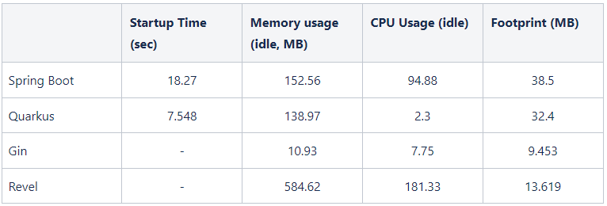
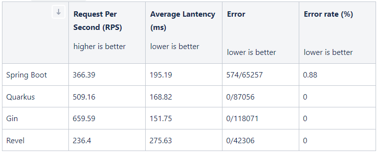
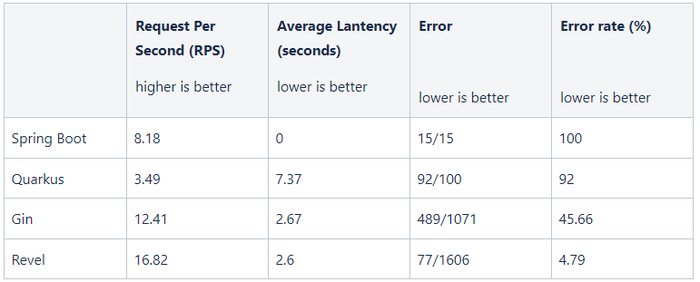
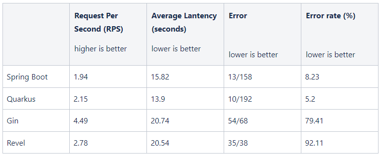

# Framework-review
An overview of microservices framework with Spring Boot, Quarkus, Gin and Revel

Sample application developed with 4 features:
- Hello World
- Database CRUD Operation
- First 5,000 Fibonacci number
- Testing

Performance analysis has been carry out with following specification:
- Running on Azure container instance service, 1vCPU, 1.5 GB RAM
- Azure MySQL flexible server, 1vCPU, 1GB RAM, 20 GB Storage
- HTTP benchmark with wrk in Ubuntu Virtual Machine (VMWare Workstation Player), i3-10105F, 16 GB RAM, 20 GB Storage
- /hello : 6 threads, 400 connections, 5s timeout, running time 30s
- /database : 6 threads, 400 connections, 10s timeout, running time 30s 
- /fibonacci: 2 threads, 30 connections, 25s timeout, running time 100s

## Performance Result

### Container Result
Lower is better

### HTTP Benchmarking
**/hello (return hello world message)**
* for error: number of error / number of request made
* container not available for scaling
* 6 threads, 400 connections, 5s timeout, running time 30s

**/database (perform database all CRUD operation in one API)**
* for error: number of error / number of request made
* database connection is not optimized
* 6 threads, 400 connections, 10s timeout, running time 30s 

**/fibonacci (compute first 5,000 fibonacci numbers)**
* for error: number of error / number of request made
* container not available for scaling
* 2 threads, 30 connections, 25s timeout, running time 100s

## External link to the source
- [[https://github.com/samueltan3972/test-with-spring](https://github.com/samueltan3972/framework-review/tree/main/test-with-spring)]([https://github.com/samueltan3972/test-with-spring](https://github.com/samueltan3972/framework-review/tree/main/test-with-spring))
- [https://github.com/samueltan3972/test-with-quarkus](https://github.com/samueltan3972/test-with-quarkus)
- [https://github.com/samueltan3972/test-with-gin](https://github.com/samueltan3972/test-with-gin)
- [https://github.com/samueltan3972/test-with-revel](https://github.com/samueltan3972/test-with-revel)
